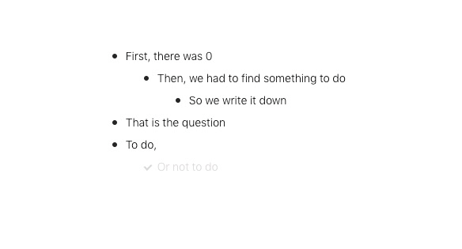

## mini-flowy
A minimal version of a nested todo list focusing on usability. Basic functions: create/delete,  move up/down, indent/undindent, move up/down lines, check/uncheck todos. See below for shortcuts.

## shortcuts
```
Enter: Create

Delete or Backspace: Delete

Down: Previous line

Up: Next line

Tab: Indent

Shift + Tab: Unindent

Shift + Up: Move line up

Shift + Down: Move line down

Command + Enter: Toggle line
```
## what it looks like


